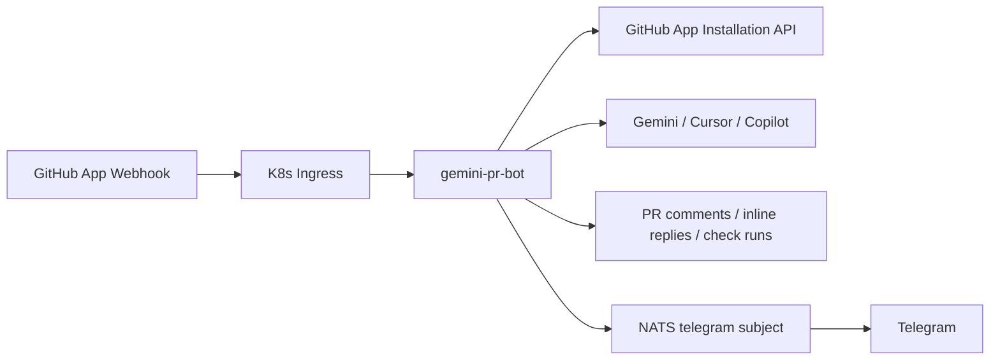
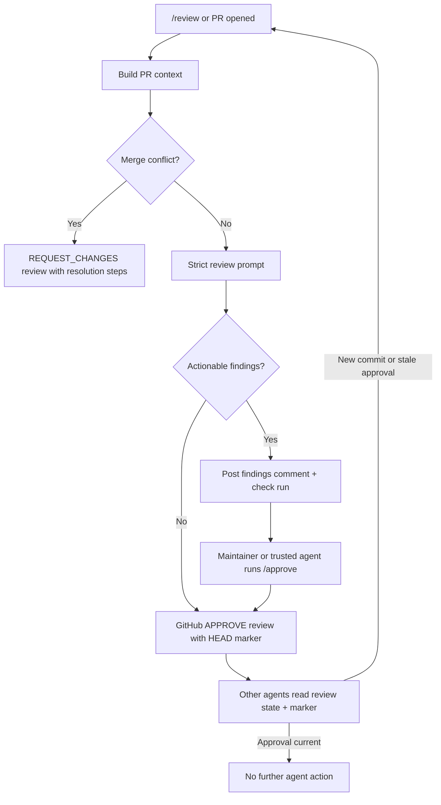
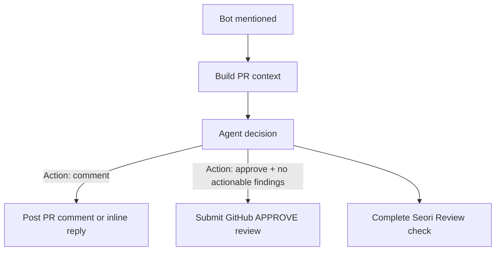
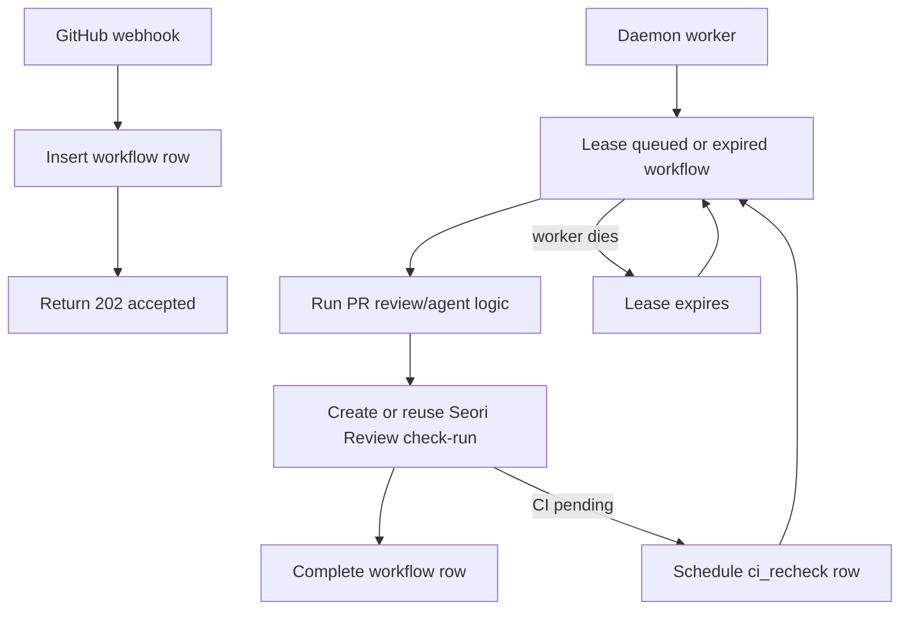

# Seori Review Bot

Seorilabs organization-wide GitHub App webhook daemon for multi-provider PR review and PR conversation replies.



## Behavior

- Reviews PRs automatically on `pull_request.opened` and `pull_request.reopened`.
- Responds to PR comments containing `@seorilabs-seori`, `@seori-bot`, `@seori`, `@gemini-cli`, or `@gemini`.
- Runs explicit review on `@gemini-cli /review`; if there are no actionable findings, it submits an approval review instead of only commenting.
- Submits a GitHub approval review on `@gemini-cli /approve [reason]`.
- Treats a normal mention as an agent handoff: it analyzes PR context, comments when action is needed, and approves when no actionable findings remain.
- Keeps review loops bounded by stating acceptance criteria first, narrowing follow-up checks to new changes plus stability regressions once those criteria are met, and closing PRs that repeatedly fail the same criteria.
- Requests changes with conflict-resolution instructions when GitHub reports merge conflicts.
- Replies directly to inline review comments when mentioned there.
- Creates a `Seori Review` check run for review and agent jobs.
- Marks `Seori Review` as `success` only when the bot approves the current HEAD; actionable review findings complete as `action_required`.
- Adds selected deep repository context from a shallow PR clone when changed files need surrounding code or config context.
- Can route AI jobs across Gemini CLI, GitHub Copilot CLI, and Cursor Agent with weighted fallback.
- Cancels stale review check runs when a PR is merged, closed, or updated while a review is running.
- Blocks approval while tests, build, lint, typecheck, or status checks are failing.
- Holds approval silently while CI is pending, then rechecks the current HEAD before approving.
- Ignores resolved inline review threads.
- Runs as a daemon with a MySQL-backed workflow queue in Kubernetes. Webhooks are durably enqueued, then a worker leases and processes jobs.
- Persists active check-run IDs so a restarted worker can resume a job instead of leaving stale pending checks.
- Publishes a best-effort Telegram notification through NATS after the bot successfully submits an approval review.
- Publishes a throttled Telegram quota summary when provider errors look like quota or rate-limit failures.
- Periodically closes stale PRs when a bot action-required review/comment has had no new commit or human response for more than 24 hours.
- Ignores public repositories by default with `ALLOW_PUBLIC_REPOS=false`.
- Only responds to `OWNER`, `MEMBER`, or `COLLABORATOR` comments by default.

## Commands

```text
@gemini-cli /review
@seorilabs-seori /review
@seori-bot /review
@seorilabs-gemini-pr-bot /review
/gemini review
@gemini-cli /approve [reason]
/gemini approve [reason]
@gemini-cli /help
@gemini-cli <question>
@seorilabs-seori <question or handoff>
@seori-bot <question or handoff>
@seorilabs-gemini-pr-bot <question or handoff>
```

`/approve` submits a real GitHub approval review for the current PR HEAD. The approval review body includes a hidden coordination marker:

```html
<!-- seorilabs-gemini-pr-bot:status=no-action-required head=<head-sha> -->
```

Other review agents should treat the latest non-stale approval marker as "no further agent action required". A new commit makes the marker stale when the repository's branch protection dismisses stale approvals.



Normal mentions use agent mode. The bot asks the configured AI provider chain to choose one action:



Approval from agent mode is guarded: the model output must include the approval action marker and the exact `No actionable findings.` finding result. Otherwise the bot only comments.

## Deep Repository Context

By default, `DEEP_REPO_CONTEXT_MODE=auto` shallow-clones the PR head only for code, workflow, action, and config changes that benefit from surrounding repository context. The bot extracts a bounded set of related text files into the prompt, then deletes the checkout from `/tmp`.

```text
DEEP_REPO_CONTEXT_MODE=auto
DEEP_REPO_CONTEXT_TIMEOUT_MS=60000
DEEP_REPO_CONTEXT_MAX_FILES=40
DEEP_REPO_CONTEXT_MAX_BYTES=80000
```

Use `off` to disable the clone path or `always` for every PR context build. A maintainer can also request deep context explicitly, for example `@seori-bot /review deep`.

## Workflow Persistence

In production, set `WORKFLOW_STORE=mysql`. The daemon creates and uses the `base.gemini_pr_bot_workflows` table.



The workflow table stores delivery dedupe keys, payload JSON, attempts, lease owner/expiry, PR identity, and `check_run_id`. If a pod restarts after creating a check-run, the next worker lease reuses that check-run instead of creating an untracked pending check.

When a review finds no actionable code issue but external CI is still pending, `Seori Review` stays `in_progress` and the bot schedules a delayed `ci_recheck` workflow instead of posting a "CI is still running" PR comment. The recheck submits approval and marks `Seori Review` successful once CI passes. It posts a PR comment only when CI fails or exceeds `CI_RECHECK_TIMEOUT_MS`.

## Metrics

The daemon exposes Prometheus metrics at `/metrics`. Production Kubernetes includes a `ServiceMonitor` for the `apps/gemini-pr-bot` service, selected by the `rpi-monitoring` Prometheus stack.

By default, `/metrics` rejects requests that arrive through a forwarded ingress header. Set `METRICS_ALLOW_FORWARDED=true` only if metrics must be reachable through the public ingress.

Key metric groups:

- `gemini_pr_bot_workflow_rows`: MySQL workflow rows by status and event.
- `gemini_pr_bot_workflow_ready_rows`: queued workflows ready to lease now.
- `gemini_pr_bot_workflow_run_duration_seconds`: workflow processing latency.
- `gemini_pr_bot_ai_provider_attempts_total`: provider success, failure, and cooldown counts.
- `gemini_pr_bot_check_runs_completed_total`: `Seori Review` outcomes by kind and conclusion.
- `gemini_pr_bot_active_tasks` and `gemini_pr_bot_active_check_runs`: in-process work gauges.

## Required Secrets

Create an organization-owned GitHub App using [docs/github-app-settings.md](docs/github-app-settings.md).

Then create the K8s secrets.

```bash
export GITHUB_APP_ID="..."
export GITHUB_PRIVATE_KEY_FILE="/path/to/seorilabs-gemini-pr-bot.private-key.pem"
export GITHUB_WEBHOOK_SECRET="..."

./scripts/create-k8s-secret.sh
./scripts/create-gemini-cli-oauth-secret.sh
./scripts/copy-mysql-app-secret.sh
```

Optional multi-provider review routing:

```bash
kubectl -n apps create secret generic gemini-pr-bot-provider-secrets \
  --from-literal=COPILOT_GITHUB_TOKEN="$COPILOT_GITHUB_TOKEN" \
  --from-literal=CURSOR_API_KEY="$CURSOR_API_KEY" \
  --dry-run=client -o yaml | kubectl apply -f -
```

Use a dedicated automation account for these credentials. Personal tokens are acceptable for a short smoke test, but not for steady production use.

The production default is:

```text
AI_REVIEW_PROVIDERS=gemini,copilot,cursor
AI_REVIEW_PROVIDER_WEIGHTS=gemini:100,copilot:0,cursor:0
AI_REVIEW_PROVIDER_FALLBACK_ORDER=gemini,cursor,copilot
COPILOT_MODEL=auto
CURSOR_MODEL=gpt-5.2
AUTO_REVIEW_IGNORED_REPOSITORIES=seorilabs/gemini-pr-bot
```

Explicit review jobs, automatic PR reviews, PR Q&A, and agent approval decisions all use the multi-provider router. This keeps `/agent` approval decisions working when Gemini CLI is temporarily quota-blocked.
Repositories listed in `AUTO_REVIEW_IGNORED_REPOSITORIES` skip automatic PR opened/reopened/synchronize reviews, while explicit mentions still work.

Optional approval Telegram notifications use the same NATS message contract as `fundevel/cronjobs`: publish `{ "text": "..." }` to `telegram.<bot>.<channel>`.

```text
APPROVAL_TELEGRAM_NOTIFY_ENABLED=true
QUOTA_TELEGRAM_NOTIFY_ENABLED=true
QUOTA_TELEGRAM_SUMMARY_INTERVAL_MS=3600000
NATS_SERVER_URL=nats://nats.data.svc.cluster.local:4222
APPROVAL_TELEGRAM_BOT=seolee_bot
APPROVAL_TELEGRAM_CHANNEL=syous
```

Quota summaries are based on provider error text and cooldown state. The Gemini/Copilot/Cursor CLI paths do not expose exact remaining quota, so the bot reports the detected quota-like failure, provider routing, weights, fallback order, and cooldown release time.

Optional stale review closing:

```text
STALE_REVIEW_CLOSE_ENABLED=true
STALE_REVIEW_THRESHOLD_MS=86400000
STALE_REVIEW_SCAN_INTERVAL_MS=1800000
STALE_REVIEW_MAX_PRS_PER_SCAN=100
STALE_REVIEW_IGNORED_REPOSITORIES=seorilabs/gemini-pr-bot
```

The stale scanner only considers hidden bot markers for the current PR HEAD. If a non-bot response appears after an action-required marker but does not mention the bot, the scanner queues one synthetic agent follow-up instead of closing immediately. If that follow-up still leaves action required, the bot writes:

```html
<!-- seorilabs-gemini-pr-bot:status=action-required kind=stale-self-trigger blocked_kind=<review|status-check|merge-conflict> head=<head-sha> response_at=<timestamp> -->
```

After a `stale-self-trigger` marker is present for the current HEAD, later unmentioned comments do not reset the stale close window. A new commit or an explicit bot mention starts a fresh review path.

## Build And Deploy

```bash
npm ci
npm run check
./scripts/build-and-push.sh
kubectl apply -k k8s
kubectl -n apps rollout restart deployment/gemini-pr-bot
kubectl -n apps rollout status deployment/gemini-pr-bot
```

If the local machine does not have Docker, build and push from the cluster with Kaniko:

```bash
./scripts/build-in-cluster.sh
kubectl apply -k k8s
kubectl -n apps rollout restart deployment/gemini-pr-bot
kubectl -n apps rollout status deployment/gemini-pr-bot
```

Webhook endpoint:

```text
https://gemini-pr-bot.vzyx.xyz/github/webhook
```

## Local Development

```bash
cp .env.example .env
npm ci
npm run dev
```
