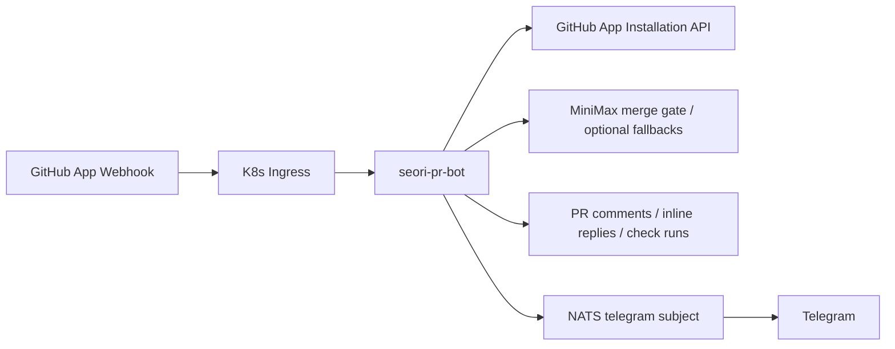
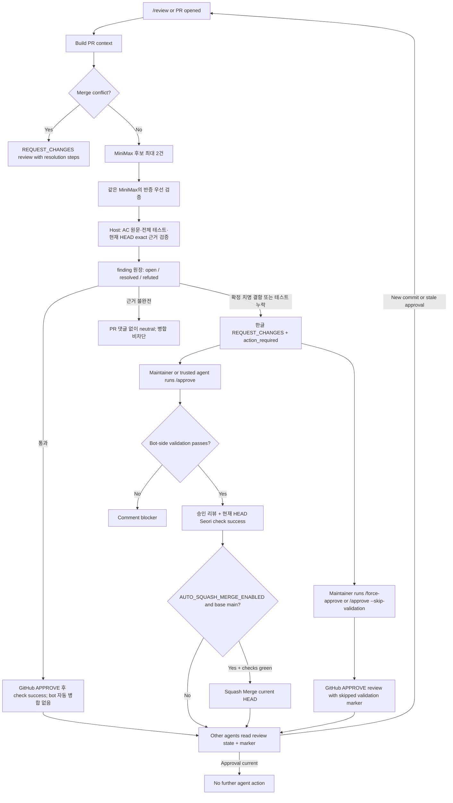
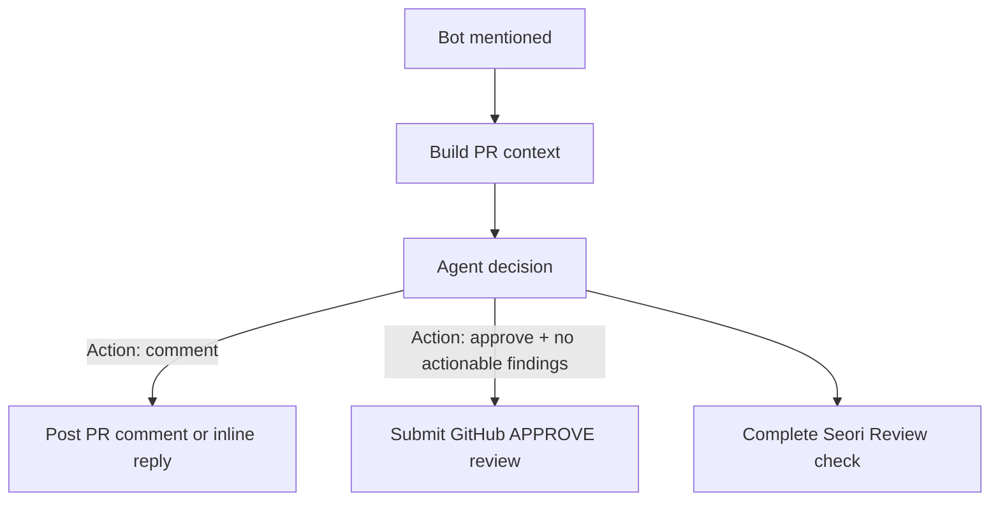
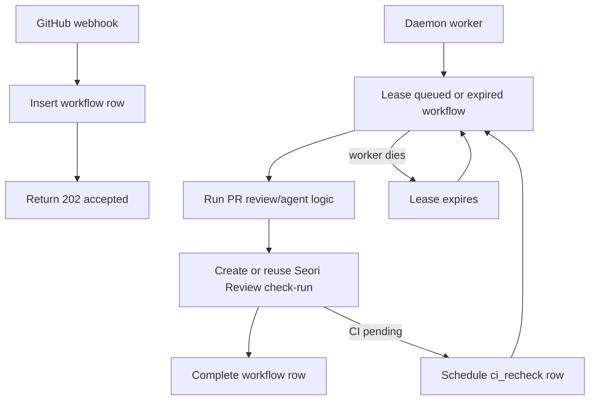

# Seori PR Bot

Seorilabs organization-wide GitHub App webhook daemon for multi-provider PR review and PR conversation replies.



## Behavior

- Reviews PRs automatically on `pull_request.opened` and `pull_request.reopened`.
- Runs a conservative structured merge gate (`STRUCTURED_REVIEW_ENABLED`) instead of a general-purpose code review.
- Maps only host-recognized checklist items or bullets under acceptance/requirements/definition-of-done/behavior headings (`동작`, `기대 동작` 포함) to visible current-HEAD test evidence; unchanged tests count when their test body and assertion are present in context. Validation-result sections such as `검증` are not acceptance criteria.
- Explicit acceptance criteria are preserved across wrapped lines and must map one-to-one to distinct model criteria. Automated criteria need grounded test evidence; explicitly manual, visual, or real-device criteria are nonblocking notes.
- Test evidence must come from a registered, active current-HEAD test with a real non-vacuous assertion. Commented code, skipped/disabled tests or suites, ordinary helper functions, comparison-only expressions, and assertion-shaped strings are rejected by the host.
- Reports at most two fatal blockers, limited to a deterministic common-path crash, permanent data loss/corruption, exploitable security/privacy exposure, or a certainly unusable primary flow. The added root line must itself directly perform the fatal outcome and end a 2-6-line ordered causal chain; normal false/null returns, UI flags, and deny-by-default security rules are rejected.
- Uses host-side strict schema and evidence validation. MiniMax does not assign severity or decide approval itself.
- Produces internal `PASS`, `FAIL`, or `ABSTAIN` decisions. A missing acceptance test blocks only after exhaustive current-HEAD inventory search; a fatal defect blocks only when MiniMax's separate verifier confirms the same host-grounded added root. Uncertainty completes as nonblocking `neutral`, with separate `확인 완료 (PASS)` and `판정 보류 항목` sections that identify grounded test evidence and the exact unresolved scope without exposing raw model reasoning.
- Omits Medium/Low findings, style/refactor suggestions, speculative risks, and automatic follow-up issue creation from the merge-gate path.
- Responds to PR comments containing `@seorilabs-seori`, `@seori-bot`, `@seori`, `@gemini-cli`, or `@gemini`.
- Runs explicit review on `@gemini-cli /review`; a gate pass submits approval, confirmed blockers request changes, and inconclusive results do not assign manual verification or block merge.
- Submits a GitHub approval review on `@gemini-cli /approve [reason]` and changes the latest `Seori Review` check for the same HEAD to `success` (or creates a successful check when none exists).
- Allows trusted maintainers to bypass bot-side merge conflict and status-check approval blockers with `@gemini-cli /approve --skip-validation [reason]` or `@gemini-cli /force-approve [reason]`.
- Treats a normal mention as an agent handoff: it analyzes PR context, comments when action is needed, and approves when no actionable findings remain.
- Requests changes with conflict-resolution instructions when GitHub reports merge conflicts.
- Replies directly to inline review comments when mentioned there.
- Creates a `Seori Review` check run for review and agent jobs.
- Marks `Seori Review` as `success` after a gate pass or explicit current-HEAD approval. Confirmed blockers complete as `action_required`; unresolved model uncertainty completes as nonblocking `neutral`.
- Adds selected deep repository context from a shallow PR clone when changed files need surrounding code or config context.
- Can route AI jobs across MiniMax, Gemini, GitHub Copilot CLI, and Cursor; production currently uses MiniMax only and does not call a paid second-opinion API.
- Cancels stale review check runs when a PR is merged, closed, or updated while a review is running.
- Blocks normal approval while tests, build, lint, typecheck, or status checks are failing.
- Holds approval silently while CI is pending, then rechecks the current HEAD before approving.
- When `AUTO_SQUASH_MERGE_ENABLED=true`, squash-merges eligible manual, agent, dependency-fastpath, and legacy approvals only when the PR base branch is `main`, the PR is not draft, mergeable, and all status checks are green. A conservative gate `PASS` approves and marks the check successful but never directly auto-merges; a maintainer retains the final merge decision.
- When `DEPENDENCY_FASTPATH_ENABLED=true`, dependabot/renovate dependency PRs skip the AI review and reuse the same approval path: `Seori Review` turns green once other CI checks pass (failing CI blocks, pending CI waits via the CI-recheck loop). Detection uses `DEPENDENCY_FASTPATH_AUTHORS` (PR author) or `DEPENDENCY_FASTPATH_LABELS` (PR label). Without this, bot-authored PRs are skipped entirely and never get the required `Seori Review` check, which blocks merge.
- Ignores resolved inline review threads.
- Runs as a daemon with a MySQL-backed workflow queue in Kubernetes. Webhooks are durably enqueued, then a worker leases and processes jobs.
- Persists active check-run IDs so a restarted worker can resume a job instead of leaving stale pending checks.
- Publishes a best-effort Telegram notification through NATS after the bot successfully submits an approval review.
- Publishes a throttled Telegram quota summary when provider errors look like quota or rate-limit failures.
- Periodically closes stale PRs when a bot action-required review/comment has had no new commit or human response for more than 24 hours.
- Ignores public repositories by default with `ALLOW_PUBLIC_REPOS=false`.
- Allows selected public repositories with `PUBLIC_REPOSITORY_ALLOWLIST`, currently `seorilabs/.github` for organization-level governance PRs.
- Only responds to `OWNER`, `MEMBER`, or `COLLABORATOR` comments by default.

## Commands

```text
@gemini-cli /review
@seorilabs-seori /review
@seori-bot /review
@seorilabs-seori-pr-bot /review
/gemini review
@gemini-cli /approve [reason]
/gemini approve [reason]
@gemini-cli /approve --skip-validation [reason]
@gemini-cli /force-approve [reason]
/gemini approve --skip-validation [reason]
/gemini force-approve [reason]
@gemini-cli /help
@gemini-cli <question>
@seorilabs-seori <question or handoff>
@seori-bot <question or handoff>
@seorilabs-seori-pr-bot <question or handoff>
```

`/approve` submits a real GitHub approval review for the current PR HEAD after bot-side merge conflict and status-check validation passes. The approval review body includes a hidden coordination marker:

```html
<!-- seorilabs-seori-pr-bot:status=no-action-required head=<head-sha> -->
```

Other review agents should treat the latest non-stale approval marker as "no further agent action required". A new commit makes the marker stale when the repository's branch protection dismisses stale approvals.

`/approve --skip-validation` and `/force-approve` skip the bot-side merge conflict and status-check blockers and submit approval immediately for the current PR HEAD. The review body records that validation was skipped. Repository branch protection can still block the merge independently. Validation-skipped approvals never trigger automatic Squash Merge.



Normal mentions use agent mode. The bot asks the configured AI provider chain to choose one action:



Approval from agent mode is guarded: the model output must include the approval action marker and the exact `No actionable findings.` finding result. Otherwise the bot only comments.

## Deep Repository Context

By default, `DEEP_REPO_CONTEXT_MODE=auto` shallow-clones the PR head only for code, workflow, action, and config changes that benefit from surrounding repository context. The bot extracts a bounded set of related text files and relevant existing/changed test candidates, marks whether the test inventory is complete, then deletes the checkout from `/tmp`.

```text
DEEP_REPO_CONTEXT_MODE=auto
DEEP_REPO_CONTEXT_TIMEOUT_MS=60000
DEEP_REPO_CONTEXT_MAX_FILES=40
DEEP_REPO_CONTEXT_MAX_BYTES=80000
```

Use `off` to disable the clone path or `always` for every PR context build. A maintainer can also request deep context explicitly, for example `@seori-bot /review deep`.

## Workflow Persistence

In production, set `WORKFLOW_STORE=mysql`. The daemon creates and uses the existing `base.gemini_pr_bot_workflows` table.



The workflow table stores delivery dedupe keys, payload JSON, attempts, lease owner/expiry, PR identity, and `check_run_id`. If a pod restarts after creating a check-run, the next worker lease reuses that check-run instead of creating an untracked pending check.

MySQL also stores conservative gate provenance in `gemini_pr_bot_review_runs`: workflow/check/repo/PR/HEAD identity, provider/model, prompt version and hashes, raw structured output, parse status, host verdict, and validation errors. Prompt source code is represented by a hash rather than persisted in full.

For review workflows, the worker records `repo_full_name`, PR number, HEAD SHA, and `check_kind=review` before creating a new `Seori Review` check-run. If another older workflow is already queued/running for the same PR HEAD, or if the new request arrived while that older review was running, the newer request is coalesced into the older workflow instead of starting a parallel AI review. Queued duplicate requests are coalesced only when their review command source and request text match, so an explicit request such as `/review deep` is not swallowed by an unrelated queued automatic review.

When a review finds no actionable code issue but external CI is still pending, `Seori Review` stays `in_progress` and the bot schedules a delayed `ci_recheck` workflow instead of posting a "CI is still running" PR comment. The recheck submits approval and marks `Seori Review` successful once CI passes. It posts a PR comment only when CI fails or exceeds `CI_RECHECK_TIMEOUT_MS`.

## Metrics

The daemon exposes Prometheus metrics at `/metrics`. Production Kubernetes includes a `ServiceMonitor` for the `apps/seori-pr-bot` service, selected by the `rpi-monitoring` Prometheus stack.

By default, `/metrics` rejects requests that arrive through a forwarded ingress header. Set `METRICS_ALLOW_FORWARDED=true` only if metrics must be reachable through the public ingress.

Key metric groups:

- `seori_pr_bot_workflow_rows`: MySQL workflow rows by status and event.
- `seori_pr_bot_workflow_ready_rows`: queued workflows ready to lease now.
- `seori_pr_bot_workflow_run_duration_seconds`: workflow processing latency.
- `seori_pr_bot_ai_provider_*`: configured provider, routing weight, credential presence, availability, cooldown, and recent success/failure/quota timestamps.
- `seori_pr_bot_ai_provider_attempts_total`: provider success, failure, and cooldown counts.
- `seori_pr_bot_check_runs_completed_total`: `Seori Review` outcomes by kind and conclusion.
- `seori_pr_bot_active_tasks` and `seori_pr_bot_active_check_runs`: in-process work gauges.

## Required Secrets

Create an organization-owned GitHub App using [docs/github-app-settings.md](docs/github-app-settings.md).

Then create the K8s secrets.

```bash
export GITHUB_APP_ID="..."
export GITHUB_PRIVATE_KEY_FILE="/path/to/seorilabs-seori-pr-bot.private-key.pem"
export GITHUB_WEBHOOK_SECRET="..."
export MINIMAX_API_KEY="..."

./scripts/create-k8s-secret.sh
./scripts/create-gemini-cli-oauth-secret.sh
./scripts/create-provider-secrets.sh
./scripts/copy-mysql-app-secret.sh
```

Optional multi-provider review routing:

```bash
./scripts/create-provider-secrets.sh   # writes seori-pr-bot-provider-secrets
```

Use a dedicated automation account for these credentials. Personal tokens are acceptable for a short smoke test, but not for steady production use.

The production routing is:

```text
AI_REVIEW_PROVIDERS=minimax
AI_REVIEW_PROVIDER_WEIGHTS=minimax:100
AI_REVIEW_PROVIDER_FALLBACK_ORDER=minimax
AI_REVIEW_TIEBREAKER_ENABLED=false
AI_REVIEW_TIEBREAKER_PROVIDER=copilot
MINIMAX_MODEL=MiniMax-M3
MINIMAX_API_BASE_URL=https://api.minimax.io/v1
COPILOT_MODEL=auto
AUTO_REVIEW_IGNORED_REPOSITORIES=seorilabs/gemini-pr-bot,seorilabs/seori-pr-bot
PUBLIC_REPOSITORY_ALLOWLIST=seorilabs/.github
AUTO_SQUASH_MERGE_ENABLED=true
```

The conservative gate uses MiniMax-M3's Anthropic-compatible Messages API at `https://api.minimax.io/anthropic/v1/messages`. It runs adaptive thinking in two bounded passes: a maximum-two candidate pass followed by an adversarial verifier pass. The host accepts only exact Korean structured output grounded in the current HEAD; an exhaustive inventory is additionally mandatory before claiming that a test is missing. No paid Gemini API call participates in the production review route. Copilot CLI, Gemini, and Cursor are not part of the production route.

Structured PR reviews use the bounded MiniMax candidate/verifier gate above. PR Q&A and agent commands still use the configured provider router. A host-confirmed fatal defect or exhaustive missing acceptance test is actionable; incomplete or ambiguous evidence becomes a nonblocking neutral decision without posting a task back to the author. Neutral output still itemizes grounded `PASS` criteria with their current-HEAD test locations and names each unresolved criterion or validation scope with a host-owned reason.
`ALLOW_PUBLIC_REPOS=false` remains the default. Only repositories listed in `PUBLIC_REPOSITORY_ALLOWLIST` are handled when they are public.
Repositories listed in `AUTO_REVIEW_IGNORED_REPOSITORIES` skip automatic PR opened/reopened/synchronize reviews, while explicit mentions still work.
When `AUTO_SQUASH_MERGE_ENABLED=true`, eligible non-gate approvals are followed by a GitHub Squash Merge attempt only for PRs targeting `main`; conservative gate approvals deliberately stop before merge. There is no repo allowlist and no branch allowlist beyond exact `main`.
Providers with weight `0` are disabled for normal random selection and fallback attempts. The explicitly configured second-opinion provider may still be called directly when it has credentials and is not cooling down.
If every enabled provider is already in cooldown before a provider command is started, the workflow is requeued until the earliest cooldown expires instead of consuming retry attempts and failing immediately.

Optional approval Telegram notifications use the same NATS message contract as `fundevel/cronjobs`: publish `{ "text": "..." }` to `telegram.<bot>.<channel>`.

```text
APPROVAL_TELEGRAM_NOTIFY_ENABLED=true
QUOTA_TELEGRAM_NOTIFY_ENABLED=true
QUOTA_TELEGRAM_SUMMARY_INTERVAL_MS=3600000
NATS_SERVER_URL=nats://nats.data.svc.cluster.local:4222
APPROVAL_TELEGRAM_BOT=seori_review_bot
APPROVAL_TELEGRAM_CHANNEL=syous
```

Quota summaries and Grafana provider health are based on provider error text, credential presence, routing config, and cooldown state. The Gemini/Copilot/Cursor CLI paths do not expose exact remaining quota, so the bot reports detected quota-like failures, provider routing, weights, fallback order, and cooldown release time instead of exact remaining credits.

Optional stale review closing:

```text
STALE_REVIEW_CLOSE_ENABLED=true
STALE_REVIEW_THRESHOLD_MS=86400000
STALE_REVIEW_SCAN_INTERVAL_MS=1800000
STALE_REVIEW_MAX_PRS_PER_SCAN=100
STALE_REVIEW_IGNORED_REPOSITORIES=seorilabs/gemini-pr-bot,seorilabs/seori-pr-bot
```

The stale scanner only considers hidden bot markers for the current PR HEAD. If a non-bot response appears after an action-required marker but does not mention the bot, the scanner queues one synthetic agent follow-up instead of closing immediately. If that follow-up still leaves action required, the bot writes:

The latest same-HEAD `no-action-required` marker clears older blockers. Legacy `kind=review` markers are treated as nonblocking because older gate versions used them for model uncertainty; new confirmed blockers use `kind=review-test` or `kind=review-fatal` and remain stale-close eligible.

```html
<!-- seorilabs-seori-pr-bot:status=action-required kind=stale-self-trigger blocked_kind=<review|status-check|merge-conflict> head=<head-sha> response_at=<timestamp> -->
```

After a `stale-self-trigger` marker is present for the current HEAD, later unmentioned comments do not reset the stale close window. A new commit or an explicit bot mention starts a fresh review path.

## Build And Deploy

```bash
npm ci
npm run check
./scripts/build-and-push.sh
kubectl apply -k k8s
kubectl -n apps rollout restart deployment/seori-pr-bot
kubectl -n apps rollout status deployment/seori-pr-bot
```

On macOS, `build-and-push.sh` starts and uses the Colima Docker context when no context is explicitly selected. The default build archives committed `HEAD` and stops on tracked uncommitted changes. Before updating `latest`, it runs `git fetch --quiet origin main` and then requires `main` to track `origin/main` with both refs at the exact same commit. A fetch failure, or a branch that is ahead, behind, diverged, detached, missing an upstream, or tracking a different upstream, pushes only its commit tag and prints a warning.

For a temporary worktree image, opt in explicitly. When `TAG` is omitted, the script creates a unique `<sha>-worktree-<timestamp>-<pid>` tag and does not update `latest`:

```bash
BUILD_WORKTREE=1 ./scripts/build-and-push.sh
```

Use an explicit tag when another environment must pull that worktree image. Updating `latest` from a worktree or non-`main` branch is intentionally opt-in:

```bash
BUILD_WORKTREE=1 TAG="review-gate-local" ./scripts/build-and-push.sh
BUILD_WORKTREE=1 TAG="review-gate-local" PUSH_LATEST=1 ./scripts/build-and-push.sh
```

`PUSH_LATEST=1` is also the explicit override when an operator intentionally needs to publish `latest` while local `main` does not exactly match `origin/main`.

The same ARM64 build and push remains available as a manual GitHub Actions workflow. A non-`main` run publishes only its requested/SHA tag; only `main` updates `latest`.

```bash
gh workflow run build-image.yml --ref main
gh run watch --exit-status
```

Kaniko remains an emergency fallback when neither local Colima nor the Actions runner is available:

```bash
./scripts/build-in-cluster.sh
kubectl apply -k k8s
kubectl -n apps rollout restart deployment/seori-pr-bot
kubectl -n apps rollout status deployment/seori-pr-bot
```

Webhook endpoint:

```text
https://seori-pr-bot.vzyx.xyz/github/webhook
```

## Local Development

```bash
cp .env.example .env
npm ci
npm run dev
```
