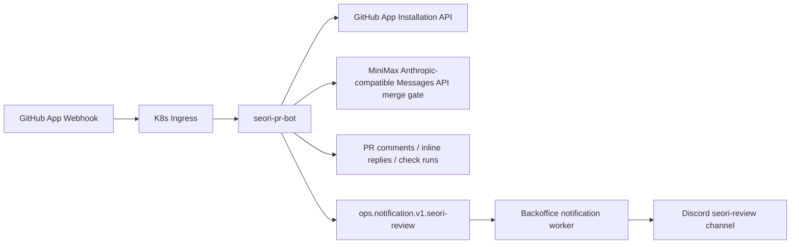
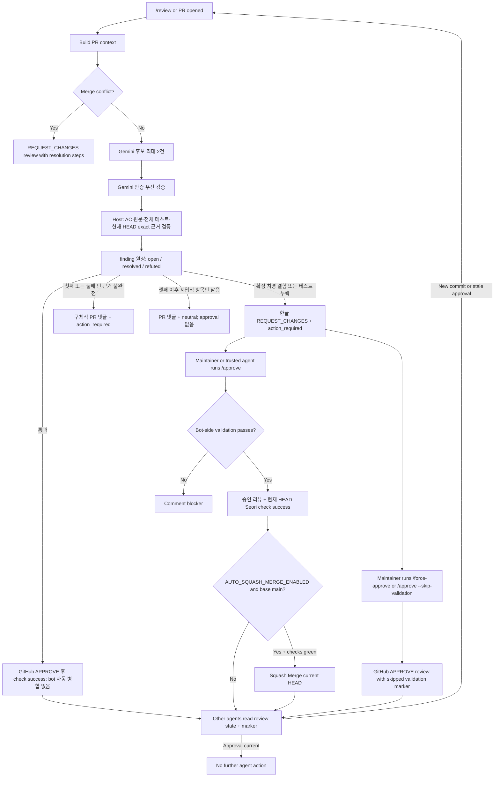
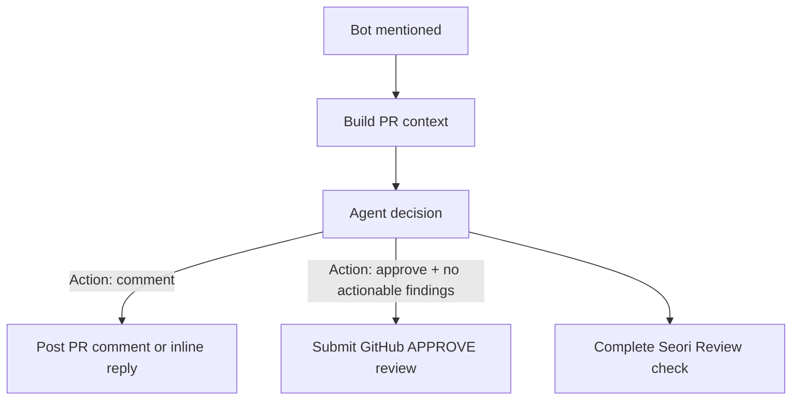
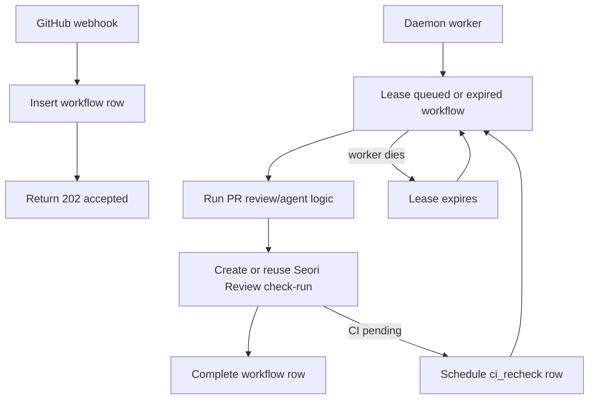

# Seori PR Bot

Seorilabs organization-wide GitHub App webhook daemon for multi-provider PR review and PR conversation replies.



## Behavior

- `ACCEPTANCE_GUIDE_MODE_ENABLED=true`에서는 Draft/일반 PR의 최초 이벤트에만 AI 인수조건 가이드를 한 번 게시합니다.
- 최초 가이드는 인수조건 근거 분류 호출을 최대 한 번만 사용하며, 후보 verifier나 형식 보정 재호출을 실행하지 않습니다.
- 누락되거나 소명이 필요한 항목은 변경 파일 단위의 resolvable review thread로 남깁니다. `Seori Review` required check는 이 스레드가 남아 있으면 `action_required`, 모두 Resolve되면 `success`입니다.
- 최초 가이드 게시 후 새 커밋과 추가 `/review` 요청은 AI를 다시 호출하지 않습니다. `pull_request.synchronize`와 `pull_request_review_thread.resolved`/`unresolved`는 현재 Seori 가이드 스레드만 다시 집계합니다.
- `@seori /reconcile-status`는 최초 가이드가 없어도 AI를 호출하지 않는 상태 복구 명령입니다. 가이드 누락을 성공으로 바꾸거나 새 가이드를 생성하지 않습니다.
- 인수조건 가이드는 GitHub approval, `REQUEST_CHANGES`, 자동 병합을 제출하지 않습니다. 가이드 생성·게시 실패의 기존 `neutral` 정책은 유지하지만, 현재 스레드·HEAD·check 조회 실패는 성공이나 `neutral`로 바꾸지 않고 복구 작업을 실패 처리합니다.
- `ACCEPTANCE_GUIDE_MODE_ENABLED=false`일 때만 아래의 기존 보수적 merge-gate/approval 동작을 사용합니다.
- Reviews PRs automatically on `pull_request.opened` and `pull_request.reopened`.
- Runs a conservative structured merge gate (`STRUCTURED_REVIEW_ENABLED`) instead of a general-purpose code review.
- Maps only host-recognized checklist items or bullets under acceptance/requirements/definition-of-done/behavior headings (`동작`, `기대 동작` 포함) to a bounded host-extracted menu of exact current-HEAD test or source evidence. The Host builds its test evidence index from the shallow clone independently from prompt-rendered file bodies, then round-robins AC-specific candidates using AC comments, PR validation mappings, and Contributor file/test references. Its Host-only scan uses a separate 64 MiB aggregate safety budget, reads changed and path-related tests first, and does not discard an individual test merely because it exceeds 200 KB. Large smoke files and later ACs therefore cannot be starved by a product-first prompt byte budget. If the aggregate scan limit is exhausted, the inventory is marked partial and the gate continues to fail closed. Unchanged tests count when they exist in the Host index; the model selects evidence IDs but cannot invent their identity. Validation-result sections such as `검증` are not acceptance criteria.
- Explicit acceptance criteria are preserved across wrapped lines and must map one-to-one to distinct model criteria. Behavioral criteria need grounded test evidence, while narrowly phrased source-wiring criteria such as a named function using a table/API may use an exact implementation line. Explicitly manual, visual, real-device, `(사람)`, or out-of-code-scope operator criteria are nonblocking, but remain visible in the review result as human handoff items.
- Test evidence must come from a registered, active current-HEAD test with a real non-vacuous assertion. Python/JS 등 여러 줄 assertion은 opening line이 아니라 닫는 delimiter까지의 전체 호출과 시작 line으로 식별하므로 같은 `self.assertIn(` 형태의 서로 다른 호출을 중복으로 오인하지 않는다. Composite criteria may select one primary plus up to three supporting lines from the same executable test; setup calls are valid only when paired with assertions, and the host validates every explicitly named output. The primary evidence must always be in the host inventory. A stale or fabricated optional supporting row is discarded, after which composite validation still requires every necessary step or output from the remaining exact evidence. For example, `sim=28800, rollover=0` requires assertions for both outputs and a missing one is named in the Contributor response. A model-provided line number is rebound only when its exact assertion quote occurs uniquely in the current HEAD; a trailing Godot multiline continuation marker may be omitted, but fabricated or ambiguous quotes remain rejected. Human labels and structured paths such as `Deploy All`/`DEPLOY_ALL` or `jobs.google-play.with`/`("jobs", "google-play", "with")` are compared with punctuation-aware canonicalization. Validation commands such as `pnpm check:i18n` are separated from assertion semantic anchors; approval still requires the current HEAD's status checks to be green. Commented code, skipped/disabled tests or suites, ordinary helper functions, comparison-only expressions, and assertion-shaped strings are rejected by the host.
- Godot `probe`/`smoke` scripts count as executable tests when a `SceneTree` lifecycle (`_init`, `_initialize`, `_ready`) either executes assertions directly or calls/`call_deferred(...)` dispatches a `_run*`/`_test*` entrypoint, and the harness has a non-zero failure exit. `_expect(...)`, suffixed helpers such as `_expect_eq(...)`/`_expect_true(...)`, `_check(...)`, and `if ...: _fail(...)` evidence are supported consistently during candidate extraction and Host grounding. A bounded loop with nested assertions may ground an explicit all-input test-matrix criterion. Large single-function smoke runners are searched to their real function boundary while semantic matching stays bounded to the assertion's local context. For API surface, adapter fallback, and no-crash acceptance criteria, an exact direct invocation in that executable harness is also valid execution evidence. A test-addition criterion may use an exact runner manifest line when it names a current-HEAD executable test file.
- Reports at most two fatal blockers, limited to a deterministic common-path crash, permanent data loss/corruption, exploitable security/privacy exposure, or a certainly unusable primary flow. The added root line must itself directly perform the fatal outcome and end a 2-6-line ordered causal chain; normal false/null returns, UI flags, and deny-by-default security rules are rejected.
- Uses Gemini structured output plus host-side strict schema and evidence validation. Gemini does not assign severity or decide approval itself.
- Produces host decisions `PASS`, `FAIL`, `FOLLOW_UP`, or `ABSTAIN`. A missing acceptance test blocks only after exhaustive current-HEAD inventory search; a fatal defect blocks only when Gemini's separate verifier confirms the same host-grounded added root. First- or second-turn uncertainty becomes an actionable `FOLLOW_UP`: the check is `action_required` and a PR comment names why each item is unresolved and exactly what the Contributor should answer or change. `ABSTAIN` is allowed only from the third review turn when every remaining item is host-classified as peripheral; it still posts a PR comment and submits no approval.
- Keeps a host-grounded acceptance PASS monotonic across follow-up turns and commits when the acceptance text is unchanged. Only rows without an AC-scoped Host validation error are eligible; their primary and supporting exact evidence is pinned ahead of bounded prompt ranking, re-extracted from the current-HEAD Host inventory, and semantically re-grounded before reuse. Changed, removed, ambiguous, skipped, vacuous, or no-longer-executable evidence fails revalidation and reopens the AC. New diffs still receive a fresh fatal-defect review and current-HEAD CI must be green before approval.
- Omits Medium/Low findings, style/refactor suggestions, speculative risks, and automatic follow-up issue creation from the merge-gate path.
- Responds to PR comments containing `@seorilabs-seori`, `@seori-bot`, `@seori`, `@gemini-cli`, or `@gemini`.
- Runs explicit review on `@gemini-cli /review`; a gate pass submits approval, confirmed blockers request changes, and incomplete early-turn evidence posts an actionable Contributor follow-up comment instead of silently deferring.
- Submits a GitHub approval review on `@gemini-cli /approve [reason]` and changes the latest `Seori Review` check for the same HEAD to `success` (or creates a successful check when none exists).
- Allows trusted maintainers to bypass bot-side merge conflict and status-check approval blockers with `@gemini-cli /approve --skip-validation [reason]` or `@gemini-cli /force-approve [reason]`.
- Treats a normal mention as an agent handoff: it analyzes PR context, comments when action is needed, and approves when no actionable findings remain.
- Requests changes with conflict-resolution instructions when GitHub reports merge conflicts.
- Replies directly to inline review comments when mentioned there.
- Creates a `Seori Review` check run for review and agent jobs.
- Marks `Seori Review` as `success` after a gate pass or explicit current-HEAD approval. Confirmed blockers and early-turn follow-up requests complete as `action_required`; only later-turn peripheral uncertainty may complete as `neutral`.
- Every completed non-approval review is visible in the PR conversation. Follow-up reviews retain the latest Seori result and Contributor responses, compare the previous reviewed HEAD with the current HEAD, and limit investigation to that incremental diff plus resolution of the previous request.
- Adds selected deep repository context from a shallow PR clone when changed files need surrounding code or config context.
- Routes production AI jobs through the MiniMax-M3 Anthropic-compatible Messages API (Coding Plan quota). GitHub Copilot is not a bot review provider.
- Cancels stale review check runs when a PR is merged, closed, or updated while a review is running.
- Blocks normal approval while tests, build, lint, typecheck, or status checks are failing.
- Holds approval silently while CI is pending, then rechecks the current HEAD before approving.
- When `AUTO_SQUASH_MERGE_ENABLED=true`, squash-merges eligible manual, agent, dependency-fastpath, and legacy approvals only when the PR base branch is `main`, the PR is not draft, mergeable, and all status checks are green. A conservative gate `PASS` approves and marks the check successful but never directly auto-merges; a maintainer retains the final merge decision.
- When `DEPENDENCY_FASTPATH_ENABLED=true`, dependabot/renovate dependency PRs skip the AI review and reuse the same approval path: `Seori Review` turns green once other CI checks pass (failing CI blocks, pending CI waits via the CI-recheck loop). Detection uses `DEPENDENCY_FASTPATH_AUTHORS` (PR author) or `DEPENDENCY_FASTPATH_LABELS` (PR label). Without this, bot-authored PRs are skipped entirely and never get the required `Seori Review` check, which blocks merge.
- Ignores resolved inline review threads.
- Runs as a daemon with a MySQL-backed workflow queue in Kubernetes. Webhooks are durably enqueued, then a worker leases and processes jobs.
- Persists active check-run IDs so a restarted worker can resume a job instead of leaving stale pending checks.
- Publishes approval and throttled provider-quota notifications through the acknowledged Backoffice NATS contract.
- Periodically closes stale PRs when a bot action-required review/comment has had no new commit or human response for more than 24 hours.
- Ignores public repositories by default with `ALLOW_PUBLIC_REPOS=false`.
- Allows selected public repositories with `PUBLIC_REPOSITORY_ALLOWLIST`, currently `seorilabs/.github`, `seorilabs/platform`, and `seorilabs/seorilabs-backoffice` for central governance PRs. Automatic review on an allowlisted public repository still requires a same-repository PR whose author has current `write`, `maintain`, or `admin` repository permission; a trusted maintainer must explicitly request review for external forks.
- Only responds to `OWNER`, `MEMBER`, or `COLLABORATOR` comments by default. On an allowlisted public repository, current `write`, `maintain`, or `admin` repository permission is the source of truth because GitHub App installation responses can report an organization member as `CONTRIBUTOR`.

## Commands

### 검사 상태만 복구

운영 활성화 대기: 배포와 canary 검증이 승인되기 전에는 아래 명령을 실제 PR에 보내지 않습니다.
이 명령을 모르는 이전 운영 버전은 일반 AI 질문으로 처리할 수 있습니다.

`@seori /reconcile-status`는 webhook 누락 때문에 남은 `Seori Review` 상태를 복구합니다.
PR 댓글, inline 댓글, review 본문에서 기존의 신뢰된 작성자만 실행할 수 있습니다.

- `resolved`/`unresolved`와 복구 명령은 durable 대기열의 전용 worker가 처리하므로 긴 AI 리뷰를 기다리지 않습니다.
- 같은 delivery는 한 번만 등록합니다. PR별 MySQL lock으로 여러 worker의 읽기·쓰기를 직렬화하고, 이미 같은 결과이면 GitHub check를 다시 쓰지 않습니다.
- 현재 PR HEAD, 모든 review-thread 페이지, Seori의 실제 publication, 현재 App 소유의 check를 읽습니다. 쓰기 직전 HEAD가 바뀌었거나 조회가 불완전하면 중단합니다.
- 쓰기 응답이 불명확하면 같은 처리 안에서 재시도하지 않습니다. durable 재시도는 GitHub를 다시 읽어 이미 반영된 쓰기를 반복하지 않습니다.
- 감사에는 delivery ID, workflow ID, repo/PR/HEAD, check ID, 이전·다음 상태, 사유, `modelCalls=0`, `costMicros=0`만 남깁니다. 쓰기 의도와 검증된 결과를 구분하며 provider 오류 본문은 출력하지 않습니다.
- 미해결 Seori thread는 `action_required`입니다. 사람·Copilot 피드백은 별도 리뷰로 유지하며 이 명령이 Resolve하거나 승인하지 않습니다. 닫히거나 병합된 PR은 변경하지 않습니다.

로컬 테스트는 `npm run check`입니다. CI에서는 격리된 MySQL 8.4 서비스로 실제 두 connection의
배타 잠금과 중복 delivery, 전용 worker 분리를 검증합니다. 로컬에 해당 서비스가 없으면 MySQL
통합 테스트만 skip되며, production DB에 테스트를 실행하지 않습니다.

운영 배포 후에는 별도 승인된 열린 canary PR에서 60초 이내 상태 갱신, 누락 webhook의 명령 복구,
AI 호출 0건을 확인해야 합니다. [중앙 이슈 #44](https://github.com/seorilabs/.github/issues/44)의
과거 Backoffice #155는 이미 병합된 PR이므로
역사적 check를 성공으로 덮어써 복구를 주장하지 않습니다.

### 일반 명령

`ACCEPTANCE_GUIDE_MODE_ENABLED=true`에서 `/review`는 기존 가이드가 있으면 상태만 갱신하지만,
최초 가이드가 없으면 AI를 호출할 수 있습니다. 상태만 복구하려면 `@seori /reconcile-status`를
사용합니다. `/approve`, `/force-approve`, 자동 approval과 자동 병합은
비활성화됩니다. 일반 멘션은 PR 맥락에 대한 답변만 남깁니다. 아래 approval 명령은
legacy mode에서만 사용할 수 있습니다.

```text
@seori /reconcile-status
@gemini-cli /review
@seorilabs-seori /review
@seori-bot /review
@seorilabs-seori-pr-bot /review
/gemini review
@gemini-cli /approve [reason]
/gemini approve [reason]
@gemini-cli /approve --skip-validation [reason]
@gemini-cli /force-approve [reason]
/gemini approve --skip-validation [reason]
/gemini force-approve [reason]
@gemini-cli /help
@gemini-cli <question>
@seorilabs-seori <question or handoff>
@seori-bot <question or handoff>
@seorilabs-seori-pr-bot <question or handoff>
```

`/approve` submits a real GitHub approval review for the current PR HEAD after bot-side merge conflict and status-check validation passes. The approval review body includes a hidden coordination marker:

```html
<!-- seorilabs-seori-pr-bot:status=no-action-required head=<head-sha> -->
```

Other review agents should treat the latest non-stale approval marker as "no further agent action required". A new commit makes the marker stale when the repository's branch protection dismisses stale approvals.

An allowed later-turn `ABSTAIN` never emits that approval marker. It posts a PR comment, emits a separate handoff marker, and submits no GitHub approval:

```html
<!-- seorilabs-seori-pr-bot:status=review-deferred head=<head-sha> -->
```

`/approve --skip-validation` and `/force-approve` skip the bot-side merge conflict and status-check blockers and submit approval immediately for the current PR HEAD. The review body records that validation was skipped. Repository branch protection can still block the merge independently. Validation-skipped approvals never trigger automatic Squash Merge.



`acceptance_coverage`의 개수와 `AC-1..N` 순서는 host가 엄격히 검증합니다. 모델이
반복 출력한 인수조건 문장은 신뢰하지 않고 같은 ID의 host 원문으로 다시 결합하므로,
따옴표·공백·의역 차이만으로 재호출하거나 승인을 보류하지 않습니다.
`test_evidence`와 최대 세 개의 `supporting_test_evidence`는 host가 current HEAD에서
추출해 prompt에 공개한 후보 안에서만 선택할 수 있습니다. 저장 후 재실행 복원처럼
여러 단계인 조건은 같은 실행 테스트의 복수 assertion을 묶어 host가 다시 검증합니다.

Normal mentions use agent mode. The bot asks the configured AI provider chain to choose one action:



Approval from agent mode is guarded: the model output must include the approval action marker and the exact `No actionable findings.` finding result. Otherwise the bot only comments.

## Deep Repository Context

By default, `DEEP_REPO_CONTEXT_MODE=auto` shallow-clones the PR head only for code, workflow, action, and config changes that benefit from surrounding repository context. The clone produces two independent outputs: a bounded set of related text files for the model prompt, and a Host-only current-HEAD test evidence index used to extract and verify exact assertions. The Host index has its own 64 MiB aggregate scan budget and prioritizes changed/path-related tests, so a large changed test remains eligible even when it cannot fit in the prompt or changed-file context. Prompt truncation does not remove tests from the Host index. `test_inventory_complete` describes the Host scan, not whether every test body fit in the prompt; exhausting the Host aggregate budget makes it partial rather than silently claiming an exhaustive search. The temporary checkout is then deleted from `/tmp`.

```text
DEEP_REPO_CONTEXT_MODE=auto
DEEP_REPO_CONTEXT_TIMEOUT_MS=60000
DEEP_REPO_CONTEXT_MAX_FILES=40
DEEP_REPO_CONTEXT_MAX_BYTES=80000
```

Use `off` to disable the clone path or `always` for every PR context build. A maintainer can also request deep context explicitly, for example `@seori-bot /review deep`.

## Workflow Persistence

In production, set `WORKFLOW_STORE=mysql`. The daemon creates and uses the existing `base.gemini_pr_bot_workflows` table.



The workflow table stores delivery dedupe keys, payload JSON, attempts, lease owner/expiry, PR identity, and `check_run_id`. If a pod restarts after creating a check-run, the next worker lease reuses that check-run instead of creating an untracked pending check.

GitHub API `5xx` responses are treated as transient upstream failures. The workflow is requeued without consuming its normal attempt budget for up to `WORKFLOW_TRANSIENT_RETRY_WINDOW_MS` (30 minutes by default), using a 30-second exponential backoff capped by `WORKFLOW_TRANSIENT_RETRY_MAX_DELAY_MS` (5 minutes by default). After that window, the normal bounded attempt and final-failure path applies.

MySQL also stores conservative gate provenance in `gemini_pr_bot_review_runs`: workflow/check/repo/PR/HEAD identity, provider/model, prompt version and hashes, raw structured output, parse status, host verdict, and validation errors. Follow-up reviews read a bounded recent history from this table, carry only AC rows that had no Host validation error, and revalidate their exact evidence on the current HEAD. Prompt source code is represented by a hash rather than persisted in full.

For review workflows, the worker records `repo_full_name`, PR number, HEAD SHA, and `check_kind=review` before creating a new `Seori Review` check-run. If another older workflow is already queued/running for the same PR HEAD, or if the new request arrived while that older review was running, the newer request is coalesced into the older workflow instead of starting a parallel AI review. Queued duplicate requests are coalesced only when their review command source and request text match, so an explicit request such as `/review deep` is not swallowed by an unrelated queued automatic review.

When a review finds no actionable code issue but external CI is still pending, `Seori Review` stays `in_progress` and the bot schedules a delayed `ci_recheck` workflow instead of posting a "CI is still running" PR comment. The recheck submits approval and marks `Seori Review` successful once CI passes. It posts a PR comment only when CI fails or exceeds `CI_RECHECK_TIMEOUT_MS`.

## Metrics

The daemon exposes Prometheus metrics at `/metrics`. Production Kubernetes includes a `ServiceMonitor` for the `apps/seori-pr-bot` service, selected by the `rpi-monitoring` Prometheus stack.

By default, `/metrics` rejects requests that arrive through a forwarded ingress header. Set `METRICS_ALLOW_FORWARDED=true` only if metrics must be reachable through the public ingress.

Key metric groups:

- `seori_pr_bot_workflow_rows`: MySQL workflow rows by status and event.
- `seori_pr_bot_workflow_ready_rows`: queued workflows ready to lease now.
- `seori_pr_bot_workflow_run_duration_seconds`: workflow processing latency.
- `seori_pr_bot_ai_provider_*`: configured provider, routing weight, credential presence, availability, cooldown, and recent success/failure/quota timestamps.
- `seori_pr_bot_ai_provider_attempts_total`: provider success, failure, and cooldown counts.
- `seori_pr_bot_check_runs_completed_total`: `Seori Review` outcomes by kind and conclusion.
- `seori_pr_bot_active_tasks` and `seori_pr_bot_active_check_runs`: in-process work gauges.

## Required Secrets

Create an organization-owned GitHub App using [docs/github-app-settings.md](docs/github-app-settings.md).

Then create the K8s secrets.

```bash
export GITHUB_APP_ID="..."
export GITHUB_PRIVATE_KEY_FILE="/path/to/seorilabs-seori-pr-bot.private-key.pem"
export GITHUB_WEBHOOK_SECRET="..."
export MINIMAX_API_KEY="..."
export REVIEW_GITHUB_APP_ID="4792283"
export REVIEW_GITHUB_PRIVATE_KEY_FILE="/path/to/jansoree.private-key.pem"

./scripts/create-k8s-secret.sh
./scripts/create-provider-secrets.sh
./scripts/create-review-app-secret.sh
./scripts/copy-mysql-app-secret.sh
```

Optional multi-provider review routing:

```bash
./scripts/create-provider-secrets.sh   # writes seori-pr-bot-provider-secrets
```

Use a dedicated automation account for these credentials. Personal tokens are acceptable for a short smoke test, but not for steady production use.

The production routing is:

```text
AI_REVIEW_PROVIDERS=minimax
AI_REVIEW_PROVIDER_WEIGHTS=minimax:100
AI_REVIEW_PROVIDER_FALLBACK_ORDER=minimax
AI_REVIEW_TIEBREAKER_ENABLED=false
AUTO_REVIEW_IGNORED_REPOSITORIES=seorilabs/gemini-pr-bot,seorilabs/seori-pr-bot
PUBLIC_REPOSITORY_ALLOWLIST=seorilabs/.github,seorilabs/platform,seorilabs/seorilabs-backoffice
AUTO_SQUASH_MERGE_ENABLED=true
```

The conservative gate uses MiniMax-M3's Anthropic-compatible Messages API with a strict submit_review tool contract. It runs three bounded passes: an acceptance-coverage pass (criteria plus the host evidence inventory, no diff; also proposes missing-test candidates), a fatal-defect pass (diff and current-HEAD code, at most two candidates) that runs in parallel with it, and one adversarial verifier request per candidate. A failed pass degrades only its own output (unknown coverage, no defect candidate, or an uncertain verdict) and is recorded in the run's validation errors; the whole gate abstains only when every extraction pass fails. The host accepts only exact Korean structured output grounded in the current HEAD; an exhaustive inventory is additionally mandatory before claiming that a test is missing. GitHub Copilot is not a bot review provider at all; use GitHub's native Copilot review separately.

Structured PR reviews use the bounded Gemini candidate/verifier gate above. PR Q&A and agent commands use the same configured provider router. A host-confirmed fatal defect or exhaustive missing acceptance test is actionable. Incomplete or ambiguous evidence on the first two review turns becomes `FOLLOW_UP`, posts a PR comment with a host-owned reason and concrete Contributor response, and completes the check as `action_required`. From the third turn, `neutral` is permitted only when every remaining item is peripheral; it still posts the unresolved scope and required response, submits no approval, and hands merge authorization to a current-HEAD human review.

Changed-file context is product-code-first. Small changed product files are supplied in full; large files use changed-hunk windows plus a bounded symbol outline. Fatal review is scoped to defects introduced on changed lines, so a PASS requires a visible usable patch for every current product file instead of the full body of every large file. Related tests and repository context use the remaining prompt budget.
`ALLOW_PUBLIC_REPOS=false` remains the default. Only repositories listed in `PUBLIC_REPOSITORY_ALLOWLIST` are handled when they are public.
Repositories listed in `AUTO_REVIEW_IGNORED_REPOSITORIES` skip automatic PR opened/reopened/synchronize reviews, while explicit mentions still work.
When `AUTO_SQUASH_MERGE_ENABLED=true`, eligible non-gate approvals are followed by a GitHub Squash Merge attempt only for PRs targeting `main`; conservative gate approvals deliberately stop before merge. There is no repo allowlist and no branch allowlist beyond exact `main`.
Providers with weight `0` are disabled for normal random selection and fallback attempts. The explicitly configured second-opinion provider may still be called directly when it has credentials and is not cooling down.
If every enabled provider is already in cooldown before a provider command is started, the workflow is requeued until the earliest cooldown expires instead of consuming retry attempts and failing immediately.

Discord operations notifications are accepted durably by Backoffice before this service treats delivery as successful. The subject is `ops.notification.v1.seori-review` and each request carries a stable event ID.

```text
APPROVAL_DISCORD_NOTIFY_ENABLED=true
QUOTA_DISCORD_NOTIFY_ENABLED=true
QUOTA_DISCORD_SUMMARY_INTERVAL_MS=3600000
NATS_SERVER_URL=nats://nats.data.svc.cluster.local:4222
```

Quota summaries and Grafana provider health are based on provider error text, credential presence, routing config, and cooldown state. The Gemini API and Cursor CLI do not expose exact remaining prepaid credit through this service, so the bot reports detected quota-like failures, provider routing, weights, fallback order, and cooldown release time instead of exact remaining credits.

Optional stale review closing:

```text
STALE_REVIEW_CLOSE_ENABLED=true
STALE_REVIEW_THRESHOLD_MS=86400000
STALE_REVIEW_SCAN_INTERVAL_MS=1800000
STALE_REVIEW_MAX_PRS_PER_SCAN=100
STALE_REVIEW_IGNORED_REPOSITORIES=seorilabs/gemini-pr-bot,seorilabs/seori-pr-bot
```

The stale scanner only considers hidden bot markers for the current PR HEAD. If a non-bot response appears after an action-required marker but does not mention the bot, the scanner queues one synthetic agent follow-up instead of closing immediately. If that follow-up still leaves action required, the bot writes:

The latest same-HEAD `no-action-required` marker clears older blockers. Legacy `kind=review` markers are treated as nonblocking because older gate versions used them for model uncertainty; new confirmed blockers use `kind=review-test` or `kind=review-fatal` and remain stale-close eligible.

```html
<!-- seorilabs-seori-pr-bot:status=action-required kind=stale-self-trigger blocked_kind=<review|status-check|merge-conflict> head=<head-sha> response_at=<timestamp> -->
```

After a `stale-self-trigger` marker is present for the current HEAD, later unmentioned comments do not reset the stale close window. A new commit or an explicit bot mention starts a fresh review path.

## Local Gate Probe

`scripts/gate-probe.mts` replays the production gate against the real MiniMax API on synthetic PR fixtures, so prompt and budget changes can be measured without a deploy-and-webhook cycle. It uses the same prompt builders, request/repair contract (`executeMiniMaxGateRequest`), two isolated extraction passes (coverage without the diff, fatal-defect discovery without the evidence inventory), isolated per-candidate verification, and host trust boundary (`evaluateMiniMaxReviewGateCandidates`) as the bot. `--thinking-budget=N` or `--thinking-off` applies an experimental thinking setting to the extraction passes for latency comparison; production always uses adaptive thinking.

```bash
set -a; source ~/.config/seorilabs/minimax-api-key.env; set +a   # shared/minimax/coding-plan-api-key
node --import tsx scripts/gate-probe.mts large-defect 2
node --import tsx scripts/gate-probe.mts defect
node --import tsx scripts/gate-probe.mts clean
```

Fixtures:

- `defect`: one small added GDScript file with two planted deterministic-crash defects.
- `clean`: the same file with guards; no candidate may be accepted.
- `large-defect`: a modified >20k-char file whose two defects are added in small hunks (rendered as a changed-region digest like production) plus several fully inlined generated files that push the candidate prompt toward the production context budget.

Each run prints one JSON line with per-phase `{phase, inputTokens, outputTokens, elapsedMs}` (`커버리지 분류`, `결함 후보 탐색`, `후보 반증 C-n`), prompt sizes, coverage, candidates, verifier verdicts, isolated-call failures, and host pipeline accepted/rejected codes. The process exits non-zero when no planted root is accepted, a clean fixture yields an accepted finding, an isolated verifier call fails, or any verifier request takes 300 s or longer. Per-root candidate recall (`proposed`/`accepted`) and verifier verdicts with their reasons are printed for diagnosis but do not fail the run, because the probe measures the gate mechanism rather than the model's per-candidate judgement.

## Build And Deploy

```bash
npm ci
npm run check
./scripts/build-and-push.sh
kubectl apply -k k8s
kubectl -n apps rollout restart deployment/seori-pr-bot
kubectl -n apps rollout status deployment/seori-pr-bot
```

On macOS, `build-and-push.sh` starts and uses the Colima Docker context when no context is explicitly selected. The default build archives committed `HEAD` and stops on tracked uncommitted changes. Before updating `latest`, it runs `git fetch --quiet origin main` and then requires `main` to track `origin/main` with both refs at the exact same commit. A fetch failure, or a branch that is ahead, behind, diverged, detached, missing an upstream, or tracking a different upstream, pushes only its commit tag and prints a warning.

For a temporary worktree image, opt in explicitly. When `TAG` is omitted, the script creates a unique `<sha>-worktree-<timestamp>-<pid>` tag and does not update `latest`:

```bash
BUILD_WORKTREE=1 ./scripts/build-and-push.sh
```

Use an explicit tag when another environment must pull that worktree image. Updating `latest` from a worktree or non-`main` branch is intentionally opt-in:

```bash
BUILD_WORKTREE=1 TAG="review-gate-local" ./scripts/build-and-push.sh
BUILD_WORKTREE=1 TAG="review-gate-local" PUSH_LATEST=1 ./scripts/build-and-push.sh
```

`PUSH_LATEST=1` is also the explicit override when an operator intentionally needs to publish `latest` while local `main` does not exactly match `origin/main`.

The same ARM64 build and push remains available as a manual GitHub Actions workflow. It runs on the GitHub-hosted `ubuntu-latest` runner, which is `x86_64`, so `linux/arm64` is built under QEMU emulation and takes considerably longer than the local Colima build. A non-`main` run publishes only its requested/SHA tag; only `main` updates `latest`.

```bash
gh workflow run build-image.yml --ref main
gh run watch --exit-status
```

Kaniko remains an emergency fallback when neither local Colima nor the Actions runner is available:

```bash
./scripts/build-in-cluster.sh
kubectl apply -k k8s
kubectl -n apps rollout restart deployment/seori-pr-bot
kubectl -n apps rollout status deployment/seori-pr-bot
```

Webhook endpoint:

```text
https://seori-pr-bot.vzyx.xyz/github/webhook
```

## Local Development

```bash
cp .env.example .env
npm ci
npm run dev
```
