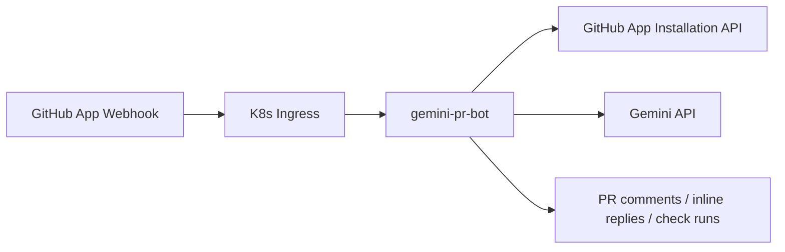

# Gemini PR Bot

Seorilabs organization-wide GitHub App webhook daemon for Gemini-backed PR review and PR conversation replies.



## Behavior

- Reviews PRs automatically on `pull_request.opened` and `pull_request.reopened`.
- Responds to PR comments containing `@gemini-cli` or `@gemini`.
- Runs explicit review on `@gemini-cli /review`.
- Replies directly to inline review comments when mentioned there.
- Creates a `Gemini PR Bot` check run for review jobs.
- Ignores public repositories by default with `ALLOW_PUBLIC_REPOS=false`.
- Only responds to `OWNER`, `MEMBER`, or `COLLABORATOR` comments by default.

## Required Secrets

Create an organization-owned GitHub App using [docs/github-app-settings.md](docs/github-app-settings.md).

Then create the K8s secret:

```bash
export GITHUB_APP_ID="..."
export GITHUB_PRIVATE_KEY_FILE="/path/to/seorilabs-gemini-pr-bot.private-key.pem"
export GITHUB_WEBHOOK_SECRET="..."
export GEMINI_API_KEY="..."

./scripts/create-k8s-secret.sh
```

## Build And Deploy

```bash
npm ci
npm run check
./scripts/build-and-push.sh
kubectl apply -k k8s
kubectl -n apps rollout status deployment/gemini-pr-bot
```

If the local machine does not have Docker, build and push from the cluster with Kaniko:

```bash
./scripts/build-in-cluster.sh
kubectl apply -k k8s
kubectl -n apps rollout status deployment/gemini-pr-bot
```

Webhook endpoint:

```text
https://gemini-pr-bot.vzyx.xyz/github/webhook
```

## Local Development

```bash
cp .env.example .env
npm ci
npm run dev
```
