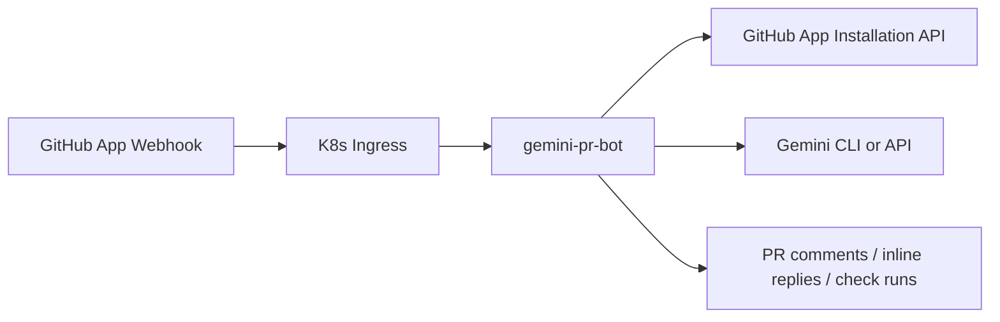
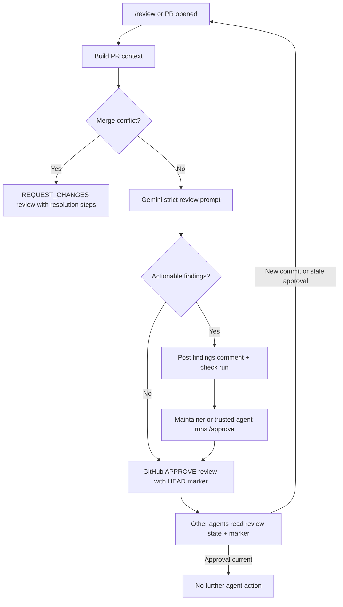
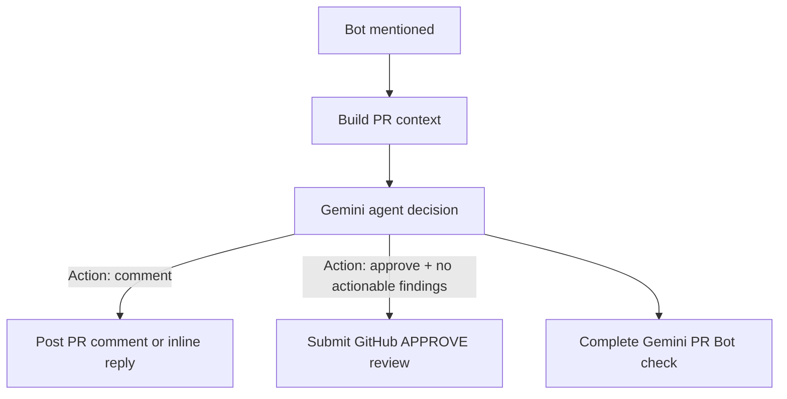
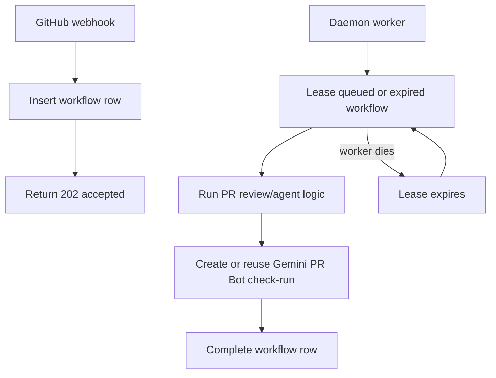

# Gemini PR Bot

Seorilabs organization-wide GitHub App webhook daemon for Gemini-backed PR review and PR conversation replies.



## Behavior

- Reviews PRs automatically on `pull_request.opened` and `pull_request.reopened`.
- Responds to PR comments containing `@gemini-cli` or `@gemini`.
- Runs explicit review on `@gemini-cli /review`; if there are no actionable findings, it submits an approval review instead of only commenting.
- Submits a GitHub approval review on `@gemini-cli /approve [reason]`.
- Treats a normal mention as an agent handoff: it analyzes PR context, comments when action is needed, and approves when no actionable findings remain.
- Requests changes with conflict-resolution instructions when GitHub reports merge conflicts.
- Replies directly to inline review comments when mentioned there.
- Creates a `Gemini PR Bot` check run for review and agent jobs.
- Runs as a daemon with a MySQL-backed workflow queue in Kubernetes. Webhooks are durably enqueued, then a worker leases and processes jobs.
- Persists active check-run IDs so a restarted worker can resume a job instead of leaving stale pending checks.
- Ignores public repositories by default with `ALLOW_PUBLIC_REPOS=false`.
- Only responds to `OWNER`, `MEMBER`, or `COLLABORATOR` comments by default.

## Commands

```text
@gemini-cli /review
@seorilabs-gemini-pr-bot /review
/gemini review
@gemini-cli /approve [reason]
/gemini approve [reason]
@gemini-cli /help
@gemini-cli <question>
@seorilabs-gemini-pr-bot <question or handoff>
```

`/approve` submits a real GitHub approval review for the current PR HEAD. The approval review body includes a hidden coordination marker:

```html
<!-- seorilabs-gemini-pr-bot:status=no-action-required head=<head-sha> -->
```

Other review agents should treat the latest non-stale Gemini approval as "no further agent action required". A new commit makes the marker stale when the repository's branch protection dismisses stale approvals.



Normal mentions use agent mode. The bot asks Gemini to choose one action:



Approval from agent mode is guarded: the model output must include the approval action marker and the exact `No actionable findings.` finding result. Otherwise the bot only comments.

## Workflow Persistence

In production, set `WORKFLOW_STORE=mysql`. The daemon creates and uses the `base.gemini_pr_bot_workflows` table.



The workflow table stores delivery dedupe keys, payload JSON, attempts, lease owner/expiry, PR identity, and `check_run_id`. If a pod restarts after creating a check-run, the next worker lease reuses that check-run instead of creating an untracked pending check.

## Required Secrets

Create an organization-owned GitHub App using [docs/github-app-settings.md](docs/github-app-settings.md).

Then create the K8s secrets.

```bash
export GITHUB_APP_ID="..."
export GITHUB_PRIVATE_KEY_FILE="/path/to/seorilabs-gemini-pr-bot.private-key.pem"
export GITHUB_WEBHOOK_SECRET="..."

./scripts/create-k8s-secret.sh
./scripts/create-gemini-cli-oauth-secret.sh
./scripts/copy-mysql-app-secret.sh
```

## Build And Deploy

```bash
npm ci
npm run check
./scripts/build-and-push.sh
kubectl apply -k k8s
kubectl -n apps rollout restart deployment/gemini-pr-bot
kubectl -n apps rollout status deployment/gemini-pr-bot
```

If the local machine does not have Docker, build and push from the cluster with Kaniko:

```bash
./scripts/build-in-cluster.sh
kubectl apply -k k8s
kubectl -n apps rollout restart deployment/gemini-pr-bot
kubectl -n apps rollout status deployment/gemini-pr-bot
```

Webhook endpoint:

```text
https://gemini-pr-bot.vzyx.xyz/github/webhook
```

## Local Development

```bash
cp .env.example .env
npm ci
npm run dev
```
